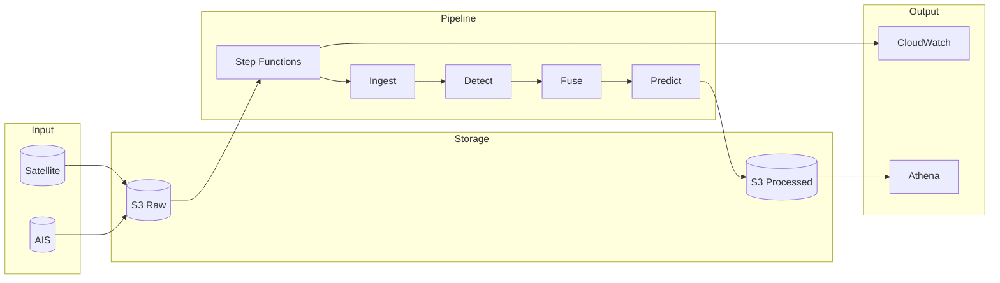
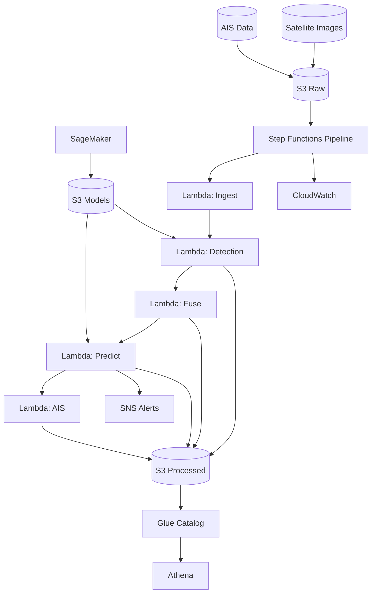
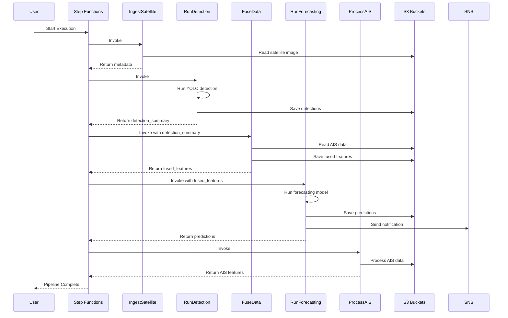
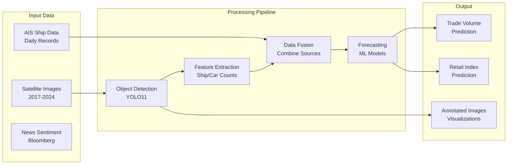
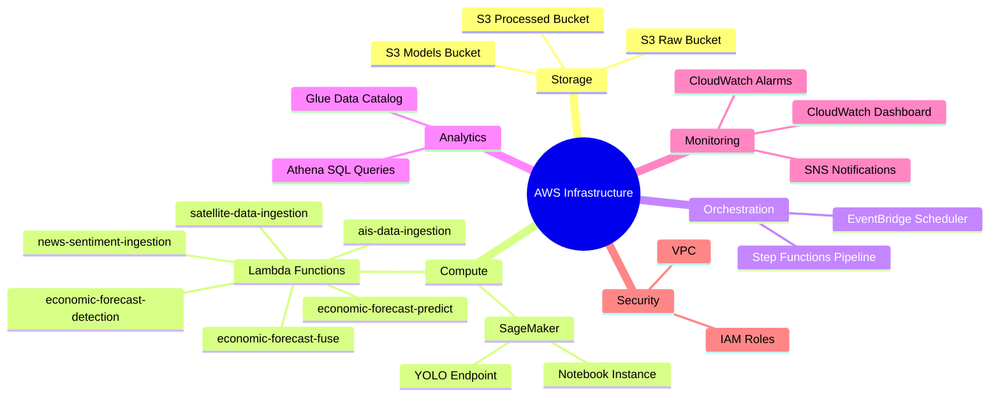

# AWS Architecture Diagram

## Full System Architecture



## Detailed Architecture



## Pipeline Execution Flow



## Data Flow Architecture



## AWS Services Overview



## Component Details

### S3 Buckets

| Bucket | Purpose | Contents |
|--------|---------|----------|
| `economic-forecast-raw` | Raw data storage | Satellite images, AIS CSVs, News data |
| `economic-forecast-processed` | Processed outputs | Detections, Features, Predictions |
| `economic-forecast-models` | ML models | YOLO weights, Forecast models |

### Lambda Functions

| Function | Purpose | Trigger |
|----------|---------|---------|
| `satellite-data-ingestion` | Log satellite uploads | S3 / Step Functions |
| `economic-forecast-detection` | Run object detection | Step Functions |
| `economic-forecast-fuse` | Combine data sources | Step Functions |
| `economic-forecast-predict` | Generate forecasts | Step Functions |
| `ais-data-ingestion` | Process AIS data | Step Functions |
| `news-sentiment-ingestion` | Analyze news sentiment | S3 trigger |

### Step Functions Pipeline

```
Start
  │
  ▼
IngestSatellite ──► RunDetection ──► FuseData ──► RunForecasting ──► ProcessAIS
                                                                          │
                                                                          ▼
                                                                   PipelineComplete
```

## Cost Estimate (Monthly)

| Service | Usage | Estimated Cost |
|---------|-------|----------------|
| S3 | 10 GB storage | $0.23 |
| Lambda | 1000 invocations | $0.20 |
| Step Functions | 100 executions | $0.25 |
| SageMaker Notebook | 10 hours | $2.30 |
| CloudWatch | Logs & metrics | $1.00 |
| **Total** | | **~$4/month** |

---

*Generated for Real-Time Economic Forecasting Project*
*University of Maryland - DATA 650*
